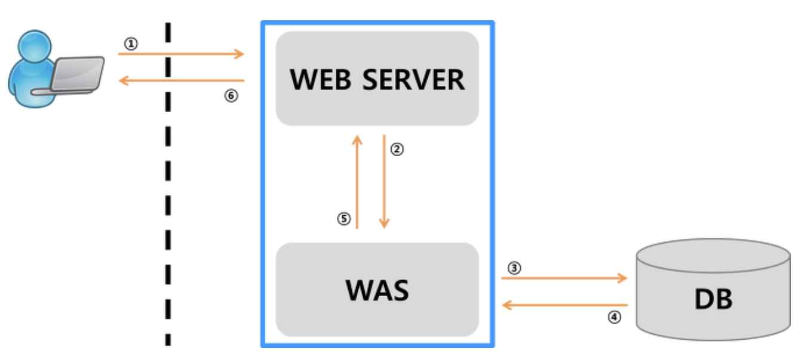

# FastAPI를 통한 딥러닝 모델 서빙, 근데 로드밸런싱을 곁들인

[GitHub - GiDaeHyeon/FastAPI-ModelServing](https://github.com/GiDaeHyeon/FastAPI-ModelServing)

### WAS vs Web Server

---

**WAS**

---



**WAS의 사전적 정의**
인터넷 상에서 HTTP 프로토콜을 통해 사용자 컴퓨터나 장치에 애플리케이션을 수행하는 미들웨어로, 주로 동적 서버 컨텐츠를 수행하는 점에서 Web Server와 구별되며, 주로 DB서버와 같이 수행

- 웹 서버가 처리할 수 없는 DB 서버와의 통신이나 다양한 로직 처리가 필요한 동적 컨텐츠를 제공한다.
- 사용자의 요구에 맞춘 웹 서비스를 제공할 수 있다.
- 예: Flask, Django, FastAPI, Spring Boot, NodeJS ...

**Web Server**

---


**Web Server의 사전적 정의**
웹 브라우저 클라이언트로부터 HTTP요청을 받아들이고, HTML문서와 같은 웹페이지를 반환하는 컴퓨터 프로그램

- 클라이언트가 웹 브라우저에서 요청을 보내면, 웹 서버는 그 요청을 받아 정적 컨텐츠를 제공한다.
- 동적 컨텐츠를 요청받으면 WAS에 해당 요청을 넘겨주고, WAS가 요청을 처리한 결과를 클라이언트에 전달한다.
- 예: Apache, NGINX

**???: 왜 Web Server를 써야하죠? WAS만으로 충분히 서비스 제공 되는데?**

---

그 입 다물라

- 각각의 구성요소들은 각자가 잘하는 일을 해야 한다.
- WAS는 DB서버와의 통신, 로직 처리 등에 집중하고, Web Server는 정적 컨텐츠 제공, 병렬처리 등 Web Server 본연의 기능에 집중한다.
- WAS가 정적 컨텐츠 요청까지 처리하게 되면, 부하가 커지고 동적 컨텐츠 처리가 지연되면서 수행 속도가 느려지고,, 페이지 노출 시간이 늘어나 서비스 품질이 떨어지고,, 서비스 품질이 떨어지면 사용자가 줄어들고,, 사용자가 줄어들면 회사가 망하고,, 나는 거지가 된다.
- Web Server는 단순히 정적 컨텐츠 제공뿐만 아니라, 프록시 포워드, 로드밸런싱 어쩌구저쩌구 정말 많은 유용한 편리한 좋은 기능을 수행한다!
    - 보안 관련해서도 SSL인증서를 사용하려면 Web Server를 사용해야 한다!
    - 여러 개의 WAS를 연결해서도 사용할 수 있다!! → Load Balancing, Fail Over에 유리하다
        - 딥러닝 모델을 서빙할 때, 2개의 GPU를 사용하고싶다면? Web Server는 필수입니다 필수!!~~우리 회사에서는 쓸 일이 없겠지만..~~
    - 여러 웹 어플리케이션 서비스 제공이 가능하다!
        - 하나의 서버에서 2개 이상의 서버를 사용하는 경우라면?! Web Server를 써야지!!
- 아무튼 정리하자면 자원 이용의 효율성, 장애 극복, 배포 및 유지보수의 편의성을 위해서 Web Server와 WAS를 분리하는 것은 필수이다!!

**Web Service Architecture**

---


- ~~서블릿이 여기서 왜 나와?~~
- 기본적인 웹 서비스의 아키텍처는 위 그림과 같다.
- Web Server는 가장 앞단에서 클라이언트의 요청을 수용한다.
    - 동적 컨텐츠요청은 WAS로 보내고, static, js 등 정적 컨텐츠 요청은 지가 수행한다.
- Web Server의 요청을 받은 WAS는 DB랑 통신을 하든 뭐든 이런저런 로직을 수행하고 그 결과값을 Web Server에 전송한다.
- WAS의 응답을 받은 Web Server는 클라이언트에 응답한다

## 그래서 지금 할 것은?

---


1. 딥러닝 배포 API(FastAPI 활용) 구축
2. NGINX 서버 세팅
3. Dockerfile 작성
4. Docker Compose를 활용한 컨테이너 관리
5. 시마이

**유의사항**

---

이 아키텍처는 보는 것만으로도 정신건강에 해악을 끼칩니다!!

- 하루만에 급하게 만든 녀석이라 아키텍처가 굉장히 더럽다...
    - 느낀점: 모델링을 할 때 애초에 배포까지 신경을 써서 코딩해야겠다!
    - 그냥 근갑다 해주세요.. 언젠가는 리팩토링 하겠지.. 일단은 돌아가니까

# TODO 코드 리팩토링 시급

# 유의점

---

- AWS Secret Token, DB ID/PW 등 외부에 절대로 노출되면 안되는 정보들은 절대로 깃헙에 커밋하면 안 된다!!
- 절대로!! 정말 유의해야합니다 이거 진짜..
- 그럼 어캄?
    - 환경변수로 관리하자!

### 딥러닝 배포 API 구축

---

**app/main.py**

```python
import os
from typing import Optional
from fastapi import FastAPI, Request, Query
from .model import SentimentCLF

app = FastAPI()
model = SentimentCLF(ckpt_dir=os.environ['CKPT_DIR'])

@app.post('/sentiment')
async def sentiment_clf(request: Request) -> Optional[dict]:
    req = await request.json()
    text = req['text']
    sentiment = model.sentiment_clf(text)
    return {'sentiment': sentiment}
```

- 간단히 한 개의 기능만을 수행하는 API 서버입니다.
- 텍스트 데이터 받아오면 모델 돌려서 실행 결과값 던져주는,, 아주 간단한,,
- 요청을 받아오면(json 형식) 요청을 읽어들여서 모델에 돌리고, 결과값을 반환해주면 된다.

**app/model.py**

```python
import torch
from typing import Optional

from NSMC.datamodule import BERTDataset
from NSMC.trainmodule import Classifier

class SentimentCLF:
    def __init__(self,
                 ckpt_dir=None):
        # Model
        model = Classifier()
        self.model = model.load_from_checkpoint(ckpt_dir)
        self.model.eval()

        # Tokenizer
        self.tokenizer = BERTDataset(use_=False).tokenize

    def sentiment_clf(self, x: Optional[str]) -> Optional[int]:
        input_ids, attention_mask, token_type_ids = self.tokenizer(x)
        y_hat = self.model(input_ids[None], attention_mask[None], token_type_ids[None])
        return int(torch.argmax(y_hat[0]).item())
```

- 서빙할 모델은 BERT 영화리뷰 감성분석 모델이다.

[PyTorch_NLP/Sentiment_Classification at main · GiDaeHyeon/PyTorch_NLP](https://github.com/GiDaeHyeon/PyTorch_NLP/tree/main/Sentiment_Classification)

- 모델 관련한 코드 및 내용은 위 깃헙 참고 바람

### NGINX 서버 세팅

---

**deployfiles/nginx.conf**

```
user  nginx;
worker_processes  1;

# Error Log File Directory(선택이긴 한데 해주는 게 신상에 이로움)
error_log  /var/log/nginx/error.log warn;
pid        /var/run/nginx.pid;

# 필수
events {
    worker_connections  1024;
}

# 빼보던가...
http {
    include       /etc/nginx/mime.types;
    default_type  application/octet-stream;

    # Log Format(선택)
    log_format  main  '$remote_addr - $remote_user [$time_local] "$request" '
                      '$status $body_bytes_sent "$http_referer" '
                      '"$http_user_agent" "$http_x_forwarded_for"';

    # Access Log File Directory(선택이긴 한데 해주는 게 신상에 이로움)
    access_log  /var/log/nginx/access.log  main;
		
    # Proxy Forward
		# 이거 안할거면 웹서버 왜씀?
    upstream myserver {
        server fastapi-1:2157;
        server fastapi-2:2158;
    }

    # Server
		# 필수 중에 필수
    server {
        listen 80;
        server_name localhost;

        location / {
            proxy_pass         http://myserver;
            proxy_redirect     off;
            proxy_set_header   Host $host;
            proxy_set_header   X-Real-IP $remote_addr;
            proxy_set_header   X-Forwarded-For $proxy_add_x_forwarded_for;          
        }
    }
}
```

- 주목할 곳은 중간 Proxy Forward 부분이다!!! 이거 짱중요
- 로드밸런싱을 위해 설정하는 부분이다. 지금 여기에서는 두 개의 서버를 띄워서 사용할 것이고, 1번 서버는 2157번 포트 2번 서버는 2158번 포트를 사용한다.
- 위 서버에 요청이 들어오면 upstream으로 선언된 myserver에 요청을 보낸다.

?? : 어라? upstream에 2개의 서버가 선언돼있는데요??
나 : 아아 그건 로드밸런싱이라는 것이다. 요청의 분산처리를 위함이지..

- 80번 포트로 웹서버에 요청이 오면 해당 요청을 myserver로 올린다.
- 요청을 받은 myserver는 내부 서버들 중 1곳에 그 요청을 수행하게끔 한다.
- NGINX는 여러가지 로드밸런싱 기능을 수행하는데, 디폴트는 라운드 로빈 방식이다.
    - 대충 돌아가면서 요청 보낸다는 뜻
    - 딥러닝 모델의 경우 두 개의 GPU를 사용해야 할 경우도 많을 거고, 모델 서빙하는 데 시간이 조금 더 걸릴 수도 있는데 위에처럼 분산처리를 해주면 효율성이 Up & Up

### Dockerfile 작성

---

도커 만든 사람은 노벨평화상 받아야 한다.
 - 기대현(1993 ~ )

**deployfiles/Dockerfile**

```docker
FROM nvidia/cuda:11.1-devel-ubuntu20.04

ARG DEBIAN_FRONTEND=noninteractive
ENV TZ=Asia/Seoul

ENV PYTHONDONTWRITEBYTECODE 1
ENV PYTHONUNBUFFERED 1
ENV CKPT_DIR some/directory

RUN apt-get update
RUN apt-get install -y python3.9
RUN apt-get install -y python3-pip

COPY ./requirements.txt /usr/src/app/requirements.txt

WORKDIR /usr/src/app

RUN pip3 install -U pip
RUN pip3 install -U wheel
RUN pip3 install pip install -r requirements.txt
RUN pip3 install torch==1.9.1+cu111 torchvision==0.10.1+cu111 -f https://download.pytorch.org/whl/torch_stable.html

WORKDIR /usr/src/app/fastapi_test
```

- 구성요소만 놓고 보면 간단하다.
- cuda 11.1버전 설치돼있는 우분투 이미지 받아와서 파이썬3.9 설치하고 디펜던시들 설치해주고, torch도 cuda 11.1용으로 다시 설치해준다.
- 개인적으로 로컬경로는 꼭꼭 숨겨두는 게 좋아서 경로들도 환경변수로 선언해준다.

### Docker-compose.yml 작성

---

**deployfiles/docker-compose.yml**

```yaml
version: "3"

services:
  fastapi-1:
    build:
      context: ./
      dockerfile: Dockerfile
    networks:
      - fastapi-test
    ports:
      - "2157:2157"
    restart: always
    container_name: fastapi-1
    volumes:
      - Some/Directory:/usr/src/app/fastapi_test
    command: bash -c "python3 -m gunicorn -k uvicorn.workers.UvicornWorker app.main:app --bind 0.0.0.0:2157 --reload"

  fastapi-2:
    build:
      context: ./
      dockerfile: Dockerfile
    networks:
      - fastapi-test
    ports:
      - "2158:2158"
    restart: always
    container_name: fastapi-2
    volumes:
      - Some/Directory:/usr/src/app/fastapi_test
    command: bash -c "python3 -m gunicorn -k uvicorn.workers.UvicornWorker app.main:app --bind 0.0.0.0:2158 --reload"

  nginx:
    image: nginx:1.19.5
    container_name: web_server
    restart: always
    networks:
      - fastapi-test
    volumes:
      - Some/Directory/deployfiles/logs:/var/log/nginx # logfolder
      - Some/Directory/deployfiles/nginx.conf:/etc/nginx/nginx.conf # conf file
    ports:
      - "80:80"
    depends_on:
      - fastapi-1
      - fastapi-2

networks:
  fastapi-test:
```

- 간단하지.. 않나요..? 길어보일 수는 있는데 별 내용은 없슴다.
- 경로 설정만 유의해주면 되겠습니다.

## 시마이

---

```powershell
$ docker-compose up --build
```

- docker-compose.yml이 있는 디렉토리에서 위 명령어만 실행해주면 된다.
    - 우리 도커님께서 컨테이너 잘 띄워서 서버 잘 실행해주실 것!